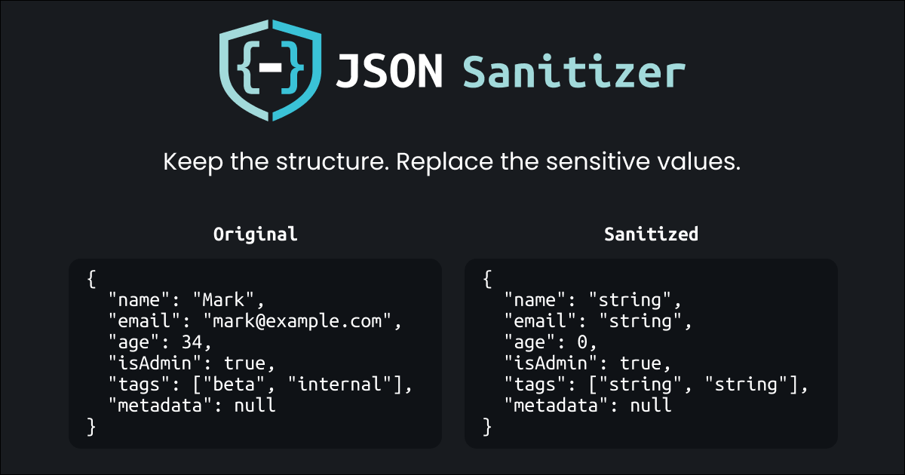

# JSON Sanitizer



Sanitize JSON values before you share them, paste them into an LLM, or post them publicly.

- Runs entirely in the browser
- Keeps your JSON shape intact
- Supports a few array handling modes

## Development

```bash
bun install
bun dev
```

## Checks

```bash
bun run check
bun run build
```